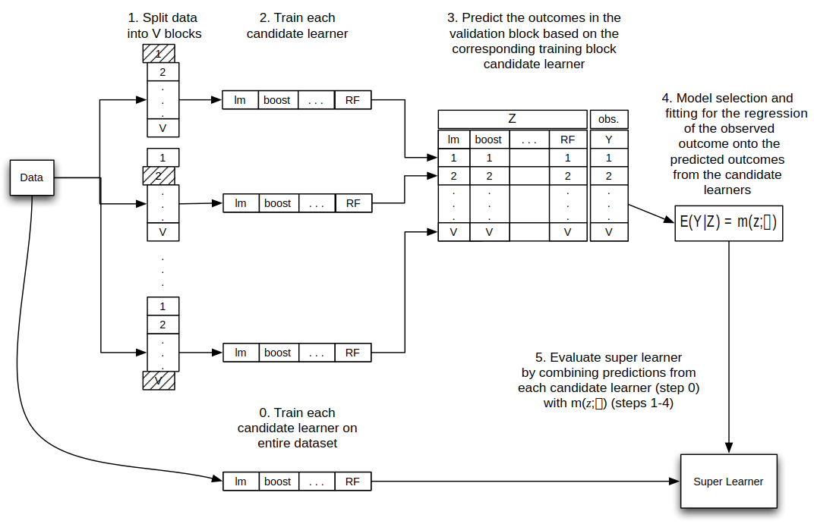

background-image: url(https://github.com/dewhitney/MachineLearning-Lecture-SuperLearner/blob/main/supermanlearner.png?raw=true)
background-size: contain
background-position: right
class: left, middle

```{r setup, include=FALSE}
options(htmltools.dir.version = FALSE)

```

.topnote[]

# Super Learner

## David Whitney* 

### Machine Learning 2022

.footnote[*based on Prof Karla Diaz-Ordaz's 2021 materials]

---
class: left

# Learning Outcomes
.content-box-blue[
After completing today's session, you will
- understand the basic idea of Super Learner (SL)

- understand the 3 important choices to be made for using SL

- be able to apply SL in a practical example

- know how to use cross-validation to measure the performance of a SL]

---
class: left

# Motivation

- You have experience with a wide library of prediction models (learners):
  
```{r dev='jpeg', echo=FALSE, fig.align='center', fig.width=12, fig.height=4, message=FALSE}
set.seed(1)

# data generating model
n <- 30L
x <- runif(n)
f <- function(x) sin(6*pi*x) + exp(2*x)
y <- f(x) + rnorm(n)

# test points
x0 <- seq(0,1,.01)

# lm
X <- data.frame(x=x)
fit1 <- lm(y~x+I(x^2)+I(x^3)+I(x^4)+I(x^5)+I(x^6), data=X)
pred1 <- predict(fit1, data.frame(x=x0))

# random forest
library(ranger)
fit2 <- ranger(y~x, data=data.frame(y=y,x=x))
pred2 <- predict(fit2, data.frame(x=x0))$predictions

# lasso
library(glmnet)
fit3 <- cv.glmnet(x=cbind(x,x^2,x^3,x^4,x^5,x^6), y=y)
pred3 <- predict(fit3, cbind(x0,x0^2,x0^3,x0^4,x0^5,x0^6))

# gradient boosting
library(xgboost)
fit4 <- xgboost(data = cbind(x=x), label = y, nrounds = 4, max_depth = 3,
                verbose = 0)
pred4 <- predict(fit4, cbind(x=x0))

layout(rbind(1:4))
par(mar=c(6.1,2.1,4.1,2.1))
plot(x,y,pch=16,cex=1.3,sub="Linear Regression",axes=F,cex.lab=1.5,cex.sub=2,xlab="",ylab="")
box()
lines(x0, pred1, lwd=2, lty=1, col=2)

plot(x,y,pch=16,cex=1.3,sub="Random Forest",axes=F,cex.lab=1.5,cex.sub=2,xlab="",ylab="")
box()
lines(x0, pred2, lwd=2, lty=1, col=3)

plot(x,y,pch=16,cex=1.3,sub="LASSO Regression",axes=F,cex.lab=1.5,cex.sub=2,xlab="",ylab="")
box()
lines(x0, pred3, lwd=2, lty=1, col=4)

plot(x,y,pch=16,cex=1.3,sub="Gradient Boosting",axes=F,cex.lab=1.5,cex.sub=2,xlab="",ylab="")
box()
lines(x0, pred4, lwd=2, lty=1, col=5)

```
  
- Your collaborators/colleagues may have many more!

- For a given application, there may be several candidate learners

- How might you choose between the candidates?

---
class: left

# Super Learner: a bird's eye view

The **Super Learner** is a meta-learning algorithm that
.content-box-blue[
- Takes the data and a library $\mathcal{L}$ of $L$ candidate learners as inputs

- Estimates performance of each learner using $V$-fold cross-validation

- Creates an optimal ensemble $m(Z;\boldsymbol{\alpha})$ of the learners ]

--

- The ensemble $m(Z;\boldsymbol{\alpha})$ offers a reproducible way to choose from (or combine) predictions from the candidate learners

--

- Super Learner ensembles also possess desirable (large sample) guarantees
  
---
class: left

# Super Learner: a bird's eye .blue[**view**]


.footnote[Adapted from *[Targeted Learning](https://link.springer.com/book/10.1007/978-3-319-65304-4)* (van der Laan & Rose, 2011)]

---
class: left
# What makes a Super Learner?

Before we can follow the steps from above, we must specify
.content-box-blue[
1. The library $\mathcal{L}$ of candidate learners

2. A loss function $\ell$ to measure performance

3. Form of the meta-learner $m(Z;\alpha)$
  ]
---
class: left
# Library

- Common algorithms to consider
.content-box-blue[
.pull-left[
- Linear regression
- Polynomial linear regression
- Random forest
- Bagging
]
.pull-right[
- GAMs
- Gradient boosting
- Neural network
- Polynomial spline regression
]]


- Select the learner algorithms using contextual knowledge of the problem

- If a custom-made algorithm (eg a clinical prediction model) is known to perform well, include it!

- It is recommended to include a parametric model

---
class: left
# Loss function

- The loss function is often the squared error loss $\ell = (Y - f(X))^2$

```{r echo=FALSE, dev='jpeg', fig.align='center', fig.width=4, fig.height=2.5, message=FALSE, warning=FALSE}

l <- function(x) x^2
x0 <- seq(-1,1,.01)

par(mar=c(6.1,5.1,0,2.1))
plot(x0, l(x0), type="l", ylab="\u2113", xlab="y-f(x)", cex.lab=2, lwd=2, col=2)
box()

```

--

.content-box-blue[
- For binary outcomes where $Y=0,1$:

  - Negative binomial log likelihood 
  
  - Rank loss function: maximises the area under the ROC curve (a function of both sensitivity and specificity), thus optimizing the algorithms ability to correctly classify observations.]

---
class: left

# Meta-regression model

- We often use non-negative least squares (NNLS)

$$ E[Y|X=x] = \alpha_1 \hat{f}_1(x) + \ldots + \alpha_L \hat{f}_L(x) $$
- In NNLS, $\alpha_l \geq 0$ and $\sum_{l=1}^L \alpha_l = 1$

- Thus $m(Z_i; \alpha)$ is a convex combination of the learners in $\mathcal{L}$ with weights $\alpha$ chosen to minimise the CV risk of SL:

$$ \hat{\alpha} = \arg \min_\alpha \sum_i (Y_i - m(Z_i; \alpha))^2 $$

- We obtain a **discrete super learner** by instead placing all the weight on the learner $\hat{f}_l$ that performs best using $V$-fold CV

---
class:center,inverse,middle

# Super Learner in R

---
class: left

# Super Learner: a bird's eye .blue[**view**]


.footnote[Adapted from *[Targeted Learning](https://link.springer.com/book/10.1007/978-3-319-65304-4)* (van der Laan & Rose, 2011)]

---
class: left

# Super Learner in R

- You will need the .red[`SuperLearner`] package installed for the practical:

```{r message=FALSE}
SL_installed <- require(SuperLearner)

if(!SL_installed) install.packages("SuperLearner")

library(SuperLearner)
```

---

class: left
# The SuperLearner function

- The main function in .red[`SuperLearner`] is itself called .red[`SuperLearner`]:

```{r }
args(SuperLearner)
```

.content-box-blue[
Key arguments for customising your Super Learner:
- .red[`SL.library`]: character vector of learners (this is $\mathcal{L}$)

- .red[`method`]: method to estimate meta-learner (based on $\ell$ and $m(Z|\alpha)$)

- Enter .red[`?SuperLearner`] in your console for more details
]

---
class: left
# Note: when coding learners for your $\mathcal{L}$...

- .red[`SuperLearner`] uses a standard interface to automate training/prediction

- This is achieved via wrapper functions that follow this template:

```{r }
SuperLearner::SL.template
```

---
class: left
# Built-in wrappers

- You **might** be able to use a built-in wrapper for your learner

```{r}
listWrappers("SL")
```

---
class: left

# Example: a univariate Super Learner

.pull-left[
Generating some data:

``` {r}
set.seed(2490) #reproducible
n <- 50
x <- runif(n, min=-4, max=4)
f <- function(x) 
     {
       .4*x-.4*x^2+.05*x^3
     }
y <- f(x) + rnorm(n)
```
]

.pull-right[
The data and (unknown) regression:

```{r echo=FALSE, out.width='100%'}
x0 <- seq(-4,4,.01)
par(mar=c(6.1,5.1,1,1))
plot(x,y,type="p",cex=1.5,cex.lab=2,cex.axis=1.5,pch=16,col=1)
lines(x0,f(x0),lwd=2,col=2)
legend(x="bottomright", legend=c('(x,y) data','true f(x)'), pch=c(16,NA), lty = c(NA,1), lwd=2, col=1:2, cex=1.5)
```
]

---

- Let's use GLM and random forest with the NNLS meta-learner

```{r echo=TRUE}
my.lib <- c("SL.randomForest", "SL.glm")

fit <- SuperLearner(Y = y, X = data.frame(x), 
                    newX = data.frame(x=x0), 
                    SL.library = my.lib, 
                    method = "method.NNLS",
                    cvControl = list(V=5L),
                    control = list(saveCVFitLibrary=TRUE))

SL.pred <- fit$SL.predict

```

```{r echo=FALSE, fig.align='center', fig.height=5, fig.width=6}
par(mar=c(6.1,5.1,1,1))
plot(x,y,type="p",cex=1.5,cex.lab=2,cex.axis=1.5,pch=16,col=1)
lines(x0,f(x0),lwd=2,col=2)
lines(x0,SL.pred,lwd=2,col=4)
legend(x="bottomright", legend=c('(x,y) data','true f(x)','SL'), pch=c(16,NA,NA), lty = c(NA,1,1), lwd=2, col=c(1:2,4), cex=1.5)

```

---
# Step 0. fit each learner in $\mathcal{L}$ on all data
The $L \times n$ matrix of full-data predictions is stored as .red[`fit$library.predict`]

```{r echo=FALSE, dev='jpeg', fig.width=10, fig.height=5}
layout(rbind(1:2))
plot(x,y,cex=1.5,cex.lab=2,cex.axis=1.5,pch=16,col=1,main="Random forest")
lines(x0, fit$library.predict[,1], lwd=2, col=4)
plot(x,y,cex=1.5,cex.lab=2,cex.axis=1.5,pch=16,col=1,main="GLM")
lines(x0, fit$library.predict[,2], lwd=2, col=4)
```

---
# Step 1. Split the data into $V=5$ blocks
The row numbers for the $V$-fold cross-validation are stored as a list

```{r}
fit$validRows #think "valid-ation sets 1-5"
```

---
# Steps 2-3. Train each learner, then predict
Recall that we do this $L \times V$ times (train on $V-1$ folds, predict on last fold)

```{r echo=FALSE, fig.align='center', fig.height=6, fig.width=12}
layout(matrix(1:10, nrow=2, byrow=FALSE))
vnames <- names(fit$cvFitLibrary)

#par(mar=c(0,0,0,0))

for (v in 1:5) {
  pch_id <- ifelse(1:50 %in% fit$validRows[[v]], 1, 16)
  col_id <- ifelse(1:50 %in% fit$validRows[[v]], 2, 4) 
  rf_pred <- predict(fit$cvFitLibrary[[v]]$SL.randomForest_All$object, data.frame(x=x0))
  lm_pred <- predict(fit$cvFitLibrary[[v]]$SL.glm_All$object, data.frame(x=x0))
  plot(x,y,pch=pch_id,col=col_id,cex=2)
  lines(x0,rf_pred,lwd=2,col=1)
  title(main = paste("RF (v = ",v,")"))
  plot(x,y,pch=pch_id,col=col_id,cex=2)
  lines(x0,lm_pred,lwd=2,col=1) 
  title(main = paste("GLM (v = ",v,")"))
}


```

.footnote[(We plot training sets as solid blue, test sets as empty red)]

---
# Step 3. Fit the meta-learner

- The $n\times L$ matrix of fitted values on the training data are stored in .red[`fit$Z`]
  - Remember each data point is belongs to **exactly one** validation set!

```{r}
head(fit$Z)
```

- The coefficient vector from NNLS is available as .red[`fit$coef`]

```{r }
fit$coef
```

- Here, most of the weight is placed on random forest

---
# Step 4. Predict on new data

- Predictions for .red[`newX`] are at .red[`fit$SL.predict`]

```{r echo=FALSE, fig.align='center', fig.height=5, fig.width=6}
par(mar=c(6.1,5.1,1,1))
plot(x,y,type="p",cex=1.5,cex.lab=2,cex.axis=1.5,pch=16,col=1)
lines(x0,f(x0),lwd=2,col=2)
lines(x0,SL.pred,lwd=2,col=4)
legend(x="bottomright", legend=c('(x,y) data','true f(x)','SL'), pch=c(16,NA,NA), lty = c(NA,1,1), lwd=2, col=c(1:2,4), cex=1.5)

```

---
class: inverse, center, middle

# Your turn to practice!

---
class: inverse, center, middle

# ... Super Learner will return in part 2

